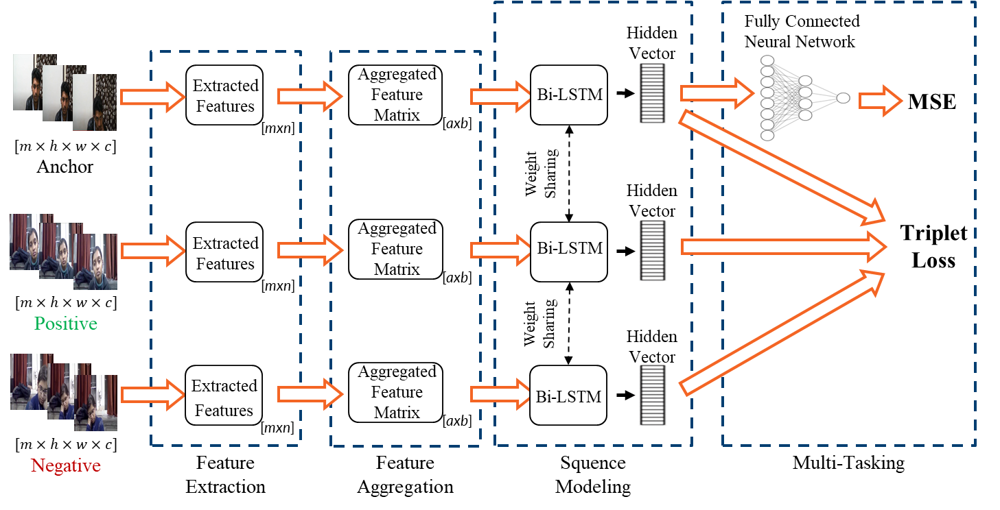
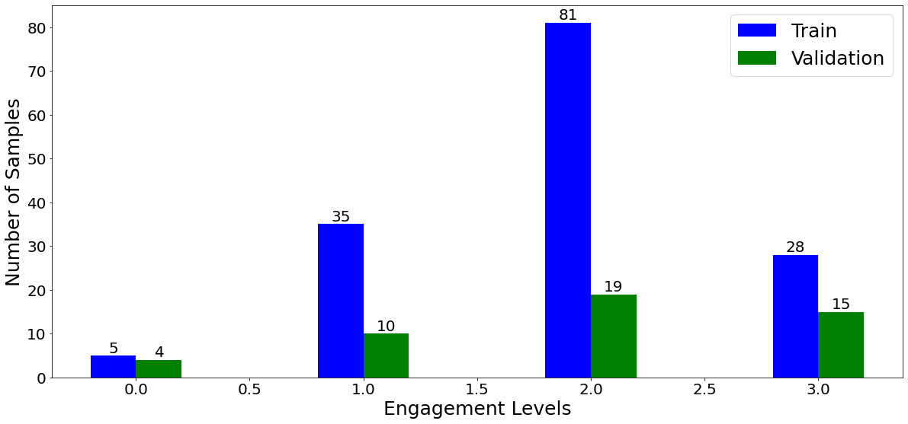
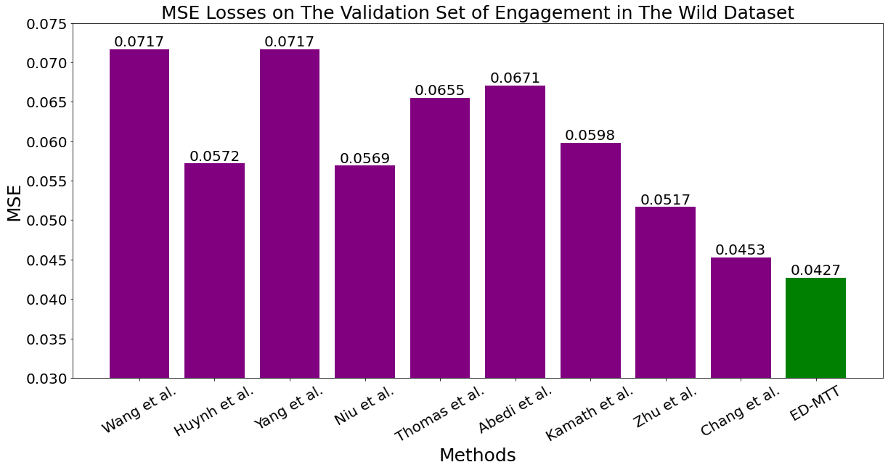

# ED-MTT

A novel Engagement Detection with Multi-Task Training (ED-MTT) system which minimizes MSE and triplet loss together to determine the engagement level of students in an e-learning environment.

# **Introduction & Problem Definition**

With the Covid-19 outbreak, the online working and learning environments became essential in our lives. For this reason, automatic analysis of non-verbal communication becomes crucial in online environments.

Engagement level is a type of social signal that can be predicted from facial expression and body pose. To this end, we propose an end-to-end deep learning-based system that detects the engagement level of the subject in an e-learning environment.

The engagement level feedback is important because:

- Make aware students of their performance in classes.
- Will help instructors to detect confusing or unclear parts of the teaching material.

# Model Architecture

The proposed system first extracts features with OpenFace, then aggregates frames in a window for calculating feature statistics as additional features. Finally,  uses Bi-LSTM for generating vector embeddings from input sequences. In this system, we introduce a triplet loss as an auxiliary task and design the system as a multi-task training framework by taking inspiration from, where self-supervised contrastive learning of multi-view facial expressions was introduced. To the best of our knowledge, this is a novel approach in engagement detection literature. The key novelty of this work is the multi-task training framework using triplet loss together with Mean Squared Error (MSE). The main contributions of this paper are as follows:

- Multi-task training with triplet and MSE losses introduces an additional regularization and reduces over-fitting due to very small sample size.
- Using triplet loss mitigates the label reliability problem since it measures relative similarity between samples.
- A system with lightweight feature extraction is efficient and highly suitable for real-life applications.

# **Dataset**

We evaluate the performance of ED-MTT on a publicly available ``[Engagement in The Wild](https://arxiv.org/abs/1804.00858)'' dataset which is comprised of separated training and validation sets.

The dataset is comprised of 78 subjects (25 females and 53 males) whose ages are ranged from 19 to 27. Each subject is recorded while watching an approximately 5 minutes long stimulus video of a Korean Language lecture.

# Results

We compare the performance of ED-MTT with 9 different works from the state-of-the-art which will be reviewed in the rest of this section. Our results show that ED-MTT outperforms these state-of-the-art methods with at least a 5.74% improvement on MSE.

